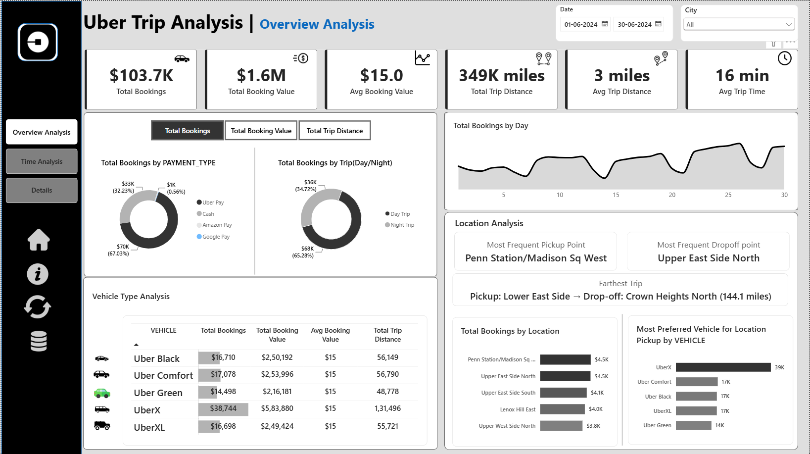
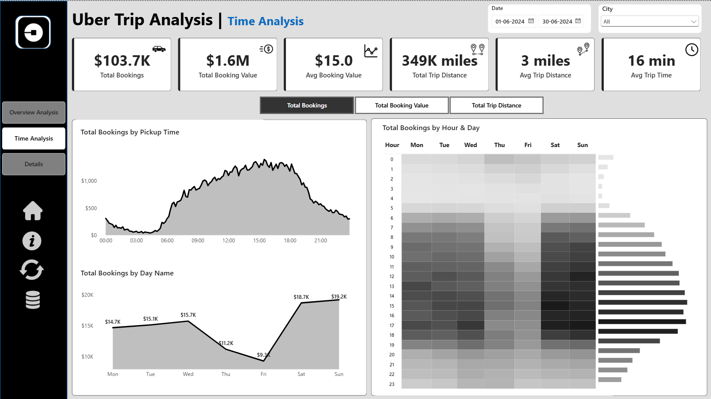
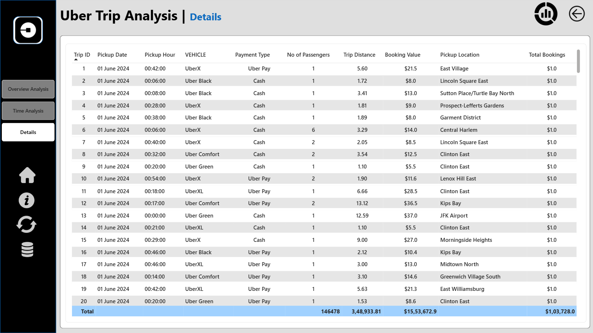

# Uber Trip Analysis Dashboard

## Project Overview

The **Uber Trip Analysis Dashboard** is an interactive Power BI project built to analyze Uber trip performance from different business perspectives. The dashboard focuses on booking performance, booking value, trip distance, trip time, vehicle performance, time-based demand, and location patterns.

The report is organized into three pages:

- **Overview Analysis** – provides a high-level view of booking, revenue, trip, vehicle, and location performance.
- **Time Analysis** – analyzes booking patterns across pickup time, days of the week, and hours of the day.
- **Details View** – provides a detailed trip-level view for exploring individual records.

The dashboard uses interactive filters and dynamic measures to make the analysis easier to explore.

## Dashboard Preview

### 1. Overview Analysis

The Overview page summarizes the main KPIs and provides comparisons across payment types, trip types, vehicle types, days, and locations.



### 2. Time Analysis

The Time Analysis page focuses on demand patterns throughout the day and across the week. It includes pickup-time trends, day-wise booking trends, and an hour-by-day heatmap.



### 3. Details View

The Details page provides granular trip-level information including Trip ID, Pickup Date, Pickup Hour, Vehicle, Payment Type, Number of Passengers, Trip Distance, Booking Value, Pickup Location, and Total Bookings.



## Key KPIs

The dashboard tracks the following KPIs:

- **Total Bookings** – total number of trips booked.
- **Total Booking Value** – total value generated from bookings.
- **Average Booking Value** – average value per booking.
- **Total Trip Distance** – total distance covered by all trips.
- **Average Trip Distance** – average distance travelled per trip.
- **Average Trip Time** – average duration of trips.

## Dashboard Features

### Overview Analysis

- KPI cards for booking, revenue, distance, and trip-time performance.
- Dynamic analysis of **Total Bookings, Total Booking Value, and Total Trip Distance**.
- Booking analysis by **Payment Type**.
- Comparison of **Day Trip and Night Trip**.
- Daily booking trend analysis to identify fluctuations in demand.
- Vehicle-level comparison of **Total Bookings, Total Booking Value, Average Booking Value, and Total Trip Distance**.
- Location analysis covering the most frequent pickup point, most frequent drop-off point, farthest trip, top booking locations, and preferred vehicle by pickup location.
- Interactive **Date** and **City** slicers.

### Time Analysis

- Booking trends by **Pickup Time** using 10-minute intervals.
- Booking trends by **Day Name** from Monday to Sunday.
- **Hour vs Day heatmap** to identify high-demand periods.
- Dynamic switching between **Total Bookings, Total Booking Value, and Total Trip Distance**.

### Details View

The Details page provides a granular table for exploring individual trip records and includes:

- Trip ID
- Pickup Date
- Pickup Hour
- Vehicle
- Payment Type
- Number of Passengers
- Trip Distance
- Booking Value
- Pickup Location
- Total Bookings

## Interactive Power BI Features

- **DAX measures** for KPI calculations and dynamic analysis.
- **Disconnected measure selector** for switching between key metrics.
- **Slicers** for Date and City filtering.
- **Conditional formatting** for vehicle-level KPI comparison.
- **Bookmarks** for navigation and additional dashboard views.
- **Drill-through** functionality for moving from summary visuals to detailed trip records.
- Interactive charts, tables, KPI cards, and heatmaps for data exploration.

## Business Insights

The dashboard helps users understand:

- How booking demand changes across different times and days.
- Which hours and days have higher or lower booking activity.
- How booking value and trip distance vary across different categories.
- Which vehicle types have higher booking volumes.
- Which pickup and drop-off locations are most frequently used.
- Where longer-distance trips occur.
- Which vehicle types are preferred at different pickup locations.

These insights can support analysis of **ride demand, vehicle allocation, operational planning, and pricing decisions**.

## Tools & Technologies

- **Power BI**
- **DAX**
- **Data Visualization**
- **Data Modeling**
- **KPI Analysis**
- **Slicers**
- **Bookmarks**
- **Drill-through**
- **Conditional Formatting**

## Project Structure

```text
Uber_Trip_Analysis/
│
├── README.md
│
└── screenshots/
    ├── 01-overview-analysis.png
    ├── 02-time-analysis.png
    └── 03-details-view.png
```

> **GitHub screenshot setup:** Keep the `README.md` file in the project root and the three dashboard screenshots inside the `screenshots` folder. The image paths in this README are relative paths, so GitHub will automatically render the screenshots in the README when this folder structure is uploaded.

## Project Objective

The objective of this project is to transform Uber trip data into an interactive Power BI report that allows users to monitor KPIs, analyze booking trends, compare vehicle performance, explore time and location patterns, and drill down into individual trip records.

## Author

**SelvaSankar M**
